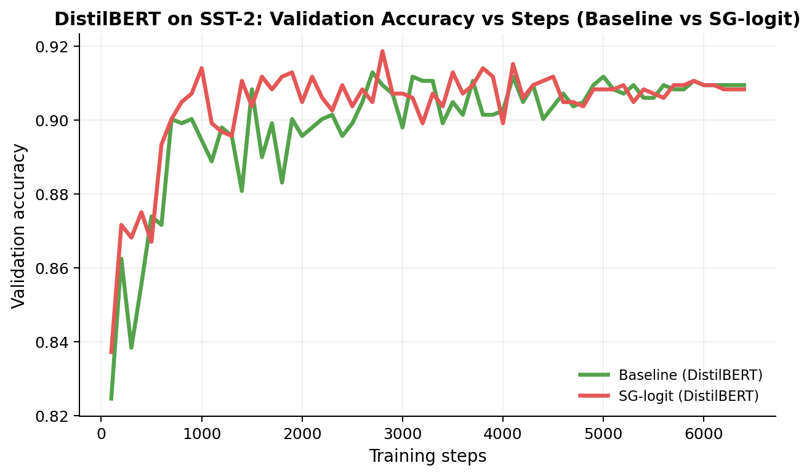
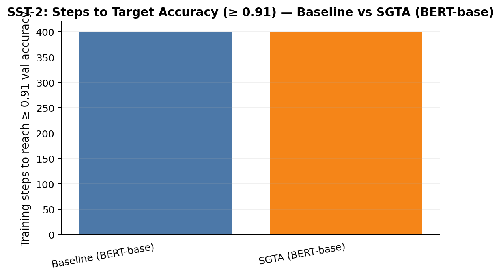

# SGTA — Synalytic Graph Transformer Augmentation
**Research preview**

SGTA is a lightweight geometric inductive bias for Transformer fine-tuning.
It introduces a small non-parametric *synalytic memory* that induces an additive bias
to attention / logits based on spherical proximity of representations — without
modifying the Transformer architecture or adding trainable parameters.

This repository presents a **mechanistic research preview**, not a benchmark claim yet.

## Motivation

Transformer attention is typically learned implicitly.
SGTA explores whether an *explicit geometric structure* can gently shape
attention dynamics and internal representation organization during fine-tuning.

The goal of this work is **not** to maximize benchmark performance,
but to study **how a controlled inductive bias affects**:
- training dynamics,
- stability across random seeds,
- calibration,
- and internal graph structure.

## Experimental setup

- **Task:** SST-2 (GLUE)
- **Models:** BERT-base, DistilBERT
- **Evaluation:** multi-seed (5 seeds)
- **Metrics:**  
  validation accuracy, steps-to-target accuracy (≥ 0.91),  
  calibration (ECE), spectral graph diagnostics
- **Training:** identical protocol for baseline and SGTA
- **Architecture:** unchanged (no new trainable parameters)

## Results: BERT-base (multi-seed)

### Learning dynamics (mean ± std)

**Observation:**  
SGTA follows a learning trajectory comparable to the baseline,
with overlapping variance envelopes and similar peak accuracy.

### Training efficiency: steps to target accuracy ≥ 0.91

**Observation:**  
SGTA does **not** accelerate convergence on average and reaches
the target accuracy in more steps than the baseline.

This indicates that SGTA is **not a speed optimization**.

### Accuracy–efficiency trade-off (per seed)

**Observation:**  
SGTA explores a different region of the quality–efficiency space,
suggesting a structural rather than purely optimization-driven effect.

### Paired per-seed deltas (SGTA − Baseline)

**Observation:**  
Performance differences are **seed-dependent and non-systematic**.
This visualization explicitly rules out single-seed or lucky-run explanations.

### Attention graph structure (mean ± std)

**Observation:**  
Despite similar external performance, SGTA consistently alters
the attention-induced interaction graph structure, as reflected
by the Laplacian spectral gap λ₂.

This suggests that SGTA primarily affects **how representations organize internally**.

## Capacity-limited regime: DistilBERT

In contrast to BERT-base, SGTA exhibits a clearer and more stable effect
in capacity-limited models:

- higher peak validation accuracy,
- faster stabilization of learning dynamics,
- reduced sensitivity to initialization.

This suggests that the synalytic bias is more effective
when representational capacity is constrained.

## Interpretation

SGTA acts as a **structural regularizer**, not a performance booster.

Its primary contribution is:
- shaping internal learning dynamics,
- modifying attention geometry,
- providing interpretable mechanistic signals.

## Limitations and scope

This preview **does not claim**:

- state-of-the-art performance
- systematic accuracy improvements across seeds
- convergence acceleration
- causal guarantees from spectral diagnostics
- validation across diverse tasks or domains

All reported effects should be interpreted as **diagnostic and exploratory**.

## Why this matters

Understanding and controlling *how* models learn is critical for:
- interpretability,
- stability,
- capacity-limited models,
- principled architectural design.

SGTA provides a minimal, low-overhead, and diagnostic-friendly testbed
for studying inductive biases in Transformer fine-tuning.

## Reproducibility and status

This repository contains:
- experiment configurations,
- training histories,
- result summaries,
- and all figures shown above.

Full training code and extended experiments are intentionally
**not released at this stage** to avoid fragmentary or misleading reuse
prior to peer-reviewed publication.

**Status:** Research preview.  
Full paper and code release are in preparation.
